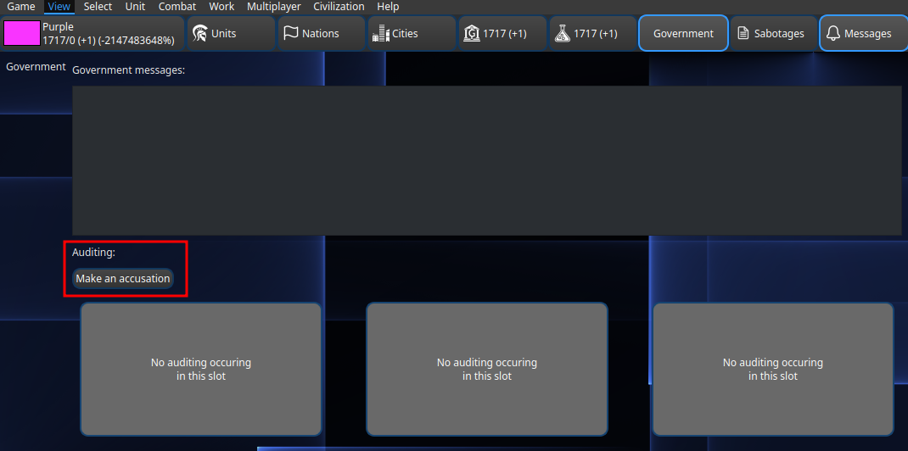
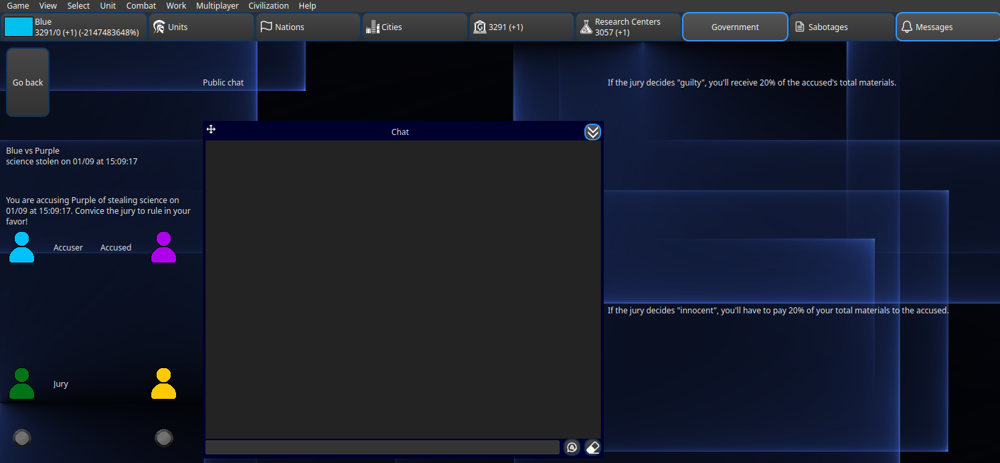
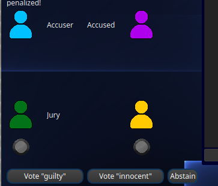

.. _accusations:

Accusations
===========

This page explains how the accusation system works, which is crucial to defend yourself from enemy sabotages.

Accusations are consulted on the Government tab on the top bar.

Starting an accusation
----------------------

You can start an accusation if someone has stolen from you. While you can start an accusation at any time, accusations will be solved on the beginning of the nest strategy phase.

To start an accusation, click on the **Make an accusation** button. Select the current sabotage and player you want to accuse. You'll need to convince the other players that you are right, otherwise you may have a penalization, so be careful!

.. note::
   There can only be 3 active accusations. If filled, you'll have to wait for the current accusations to be finished.

How it works
------------

When a player accuses another one, a global process will start, where all players will be participating. There will be three elements:

- **Accuser**: The player who started the accusation.
- **Accused**: The player who is being accused.
- **Jury**: The remainign players, which will form a jury.

Suppose for instance, that **Blue** had some gold stolen recently. After their personal investigation, they're pretty sure it was **Purple**, so they accuse it. The remaining players, **Yellow** and **Green** will become the jury who will ultimately determine if **Purple**'s guilty or not.

When an accusation begins, you can click the current accusation buttons to enter on the accusation screen. All the relevant info is displayed here: the accuser, the accused, the sabotage, and the current jury and their votes. There is also a dedicated chat that's visible to everyone and is only valid during the accusation, so players have a dedicated space to discuss the accusation. Lastly, on the right, there's the effects that will happen if the accusation goes in your side or not.

Accusations are finished automatically when both juries have voted, or manually at the beginning of the nest strategy phase. The effects for the accusation will be publicly displayed on the government report panel.

Voting
------

The jury will have to decided whether to condemn or absolve the accused. To do so, they will have to vote. If you are part of the jury, you'll have the vote options enabled at the bottom of the accusation screen.

You have a big responsibility, because you will determine the accused and accuser's fate. Each jury can either vote "guilty", "innocent", or "abstain". If you don't vote before the accusation ends, you'll automatically vote "abstain".

The final decision will depend on the votes of both juries:

(🔴- voted "guilty", 🔵-voted "innocent", ⚫- abstain)

.. list-table:: Vote Results
   :widths: 25 75
   :header-rows: 1

   * - Jury vote
     - Results
   * - ⚫⚫
     - Both juries have abstained. Nothing will happen.
   * - 🔴⚫
     - One jury voted "guilty", the other abstained. The accused is guilty.
   * - 🔵⚫
     - One jury voted "innocent", the other abstained. The accused is innocent.
   * - 🔴🔴
     - Both juries voted "guilty". The accused is guilty.
   * - 🔵🔵
     - Both juries voted "innocent". The accused is innocent.
   * - 🔴🔵
     - One jury voted "guilty", the other "innocent". There was no consensus, so nothing will happen.

If the accused is declared guilty, it will have to pay to the accuser. If the accused is declared innocent, the accuser will have to pay to the accused. If the vote resulted in a stalemate, nothing will happen to them.

After an accusation is over, regardless of it's result, it can no longer be retried.

As an accuser
-------------

You need to successfuly convince the jury that you're right. You should do so by providing evidence, and by discussing with the jury. If the jury determines the accused to be innocent, you'll have to pay them!

As an accused
-------------

Whether you're trully innocent or not, you'll have to convince the jury to overthrow the accusation. You should do so by providing evidence, and by discussing with the jury. If the jury determines you to be guilty, you'll have to pay the accuser!

As a jury
---------

The jury is the only element that will know the truth of their decision. Therefore, it's in your interested to get it right, and truly seek the truth. The accuser and accused will each be defending their position, so it's up to you to decide who's right.

If your decision was correct, you'll receive a reward, but if you were wrong, you'll be penalized. If you abstain (either explicitly or by not voting at all), you won't receive any reward or penalty.

The accuser and accused won't know whether the jury decision was right, so feel free to use this information as you see fit.