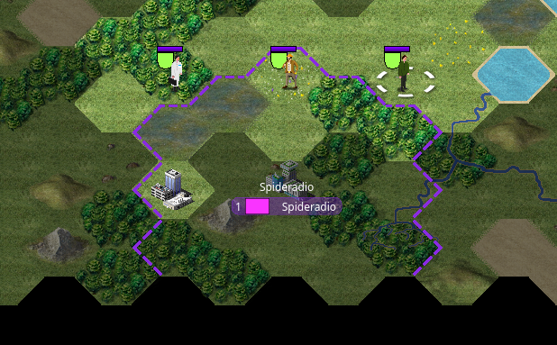
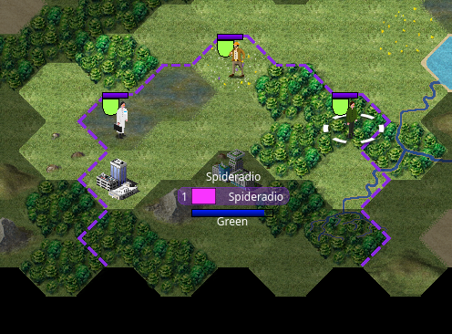
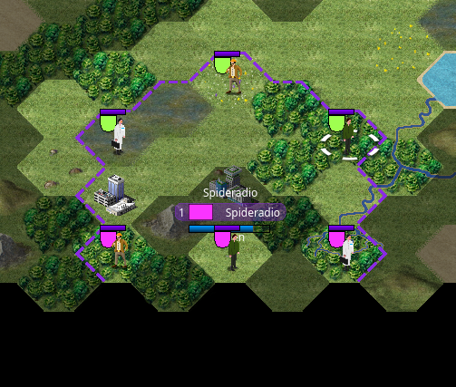
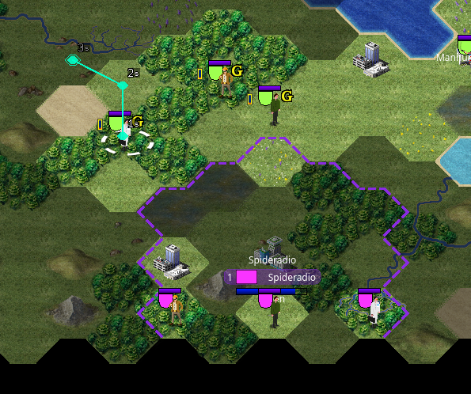
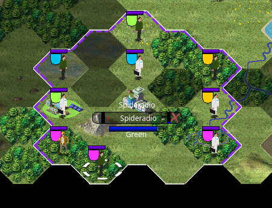

Capturing bases
===============

This page explains how to capture enemy bases.

The number of bases is limited, and players cannot build more. After the first or second session, all unoccupied bases in the map should have been claimed. To further expand, you'll have to capture other player's bases, which presents it's own challenge.

.. warning::
   You can only capture enemy bases if that players has more than one base. If they only have one remaining, you''ll be unable to capture it.

Loyalty
-------

Each base has a loyalty value, ranging from 0 to 300, indicating how loyal the base is to it's owner. This works as the base's HP. If enemy public units storm in your base, your loyalty can begin to decrease, and once it reaches 0, the base switches ownership.

Bases produce 1 loyalty per turn, and this value is increased by 1 for each public unit in your base's border. This means that if you have 3 public units in a base, it will produce 4 loyalty per turn. Enemy units will each decrease this loyalty by 1. Here are some scenarios

- ``(1 base loyalty) + 0 friendly units - 1 enemy units`` = **0**. The base's loyalty will remain unchanged.

- ``(1 base loyalty) + 0 friendly units - 3 enemy units`` = **-2**. The base's loyalty is decreasing 2 by turn. If the base's loyalty is at it's maximum (300), this base will change ownership in 2m30s.

- ``(1 base loyalty) + 3 friendly units - 3 enemy units`` = **1**. The base's loyalty is increasing by 1 per turn. It will slowly recover from this attack.

- ``(1 base loyalty) + 3 friendly units - 0 enemy units`` = **4**. The base's loyalty is increasing by 4 per turn. It will quickly recover from this attack.

Multiple players
----------------

Multiple players can attack a base. However, the first player to have moved units there will claim ownership if the base switches. This way, you can help players capture bases without stealing the base. If the original attacker leaves the base, then another player will be picked as the new claimer.

The current claimer is shown behind the base's loyalty bar.

.. warning::
   You cannot help a player defend a base directly. You may help them indirectly through trading, or by occupying spots in the maps with your public units, since public units cannot move through other public units.

Loyalty improvements
--------------------

There are two improvements you can establish in your base that affect your loyalty. These are useful if you're expecting (or not) an attack.

- **Salary Boost** - This will double the base unit's maintenance cost, but will double the maximum loyalty, slowing down attacks. Note that once you establish this, your base's current loyalty will stay the same, so you'll need to wait for it to recover to the new limit to truly benefit from this.
- **Salary Cuts** - This will completely cut all base unit's maintenance cost, but will reduce your maximum loyalty to 75%. While reducing in costs, if players attack this base it will be severly weakened. Removing this improvement will restore your maximum loyalty to 100%, but will not restore your current loyalty, which will have to recover.

These are mutually exclusive, but you can remove improvements at any time.