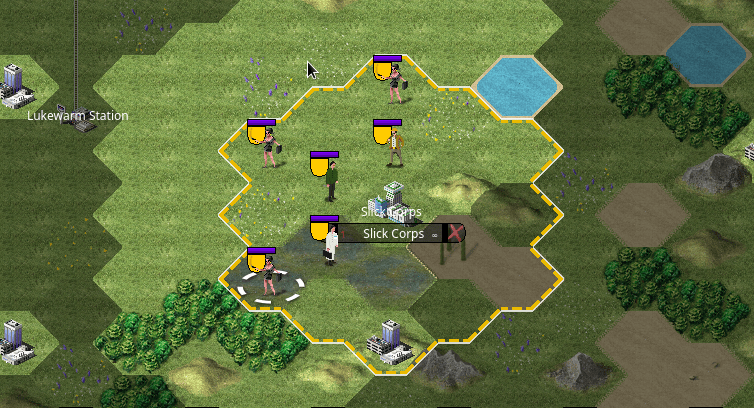
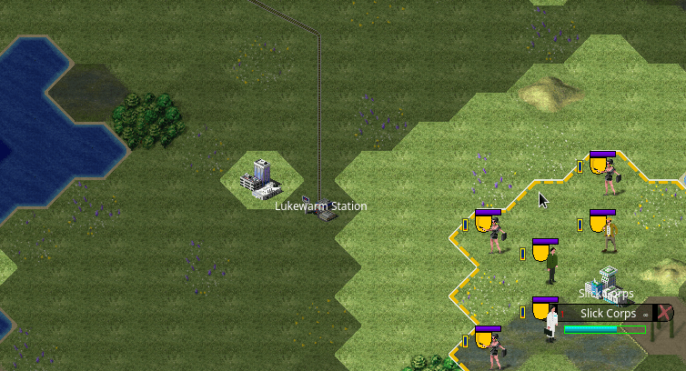
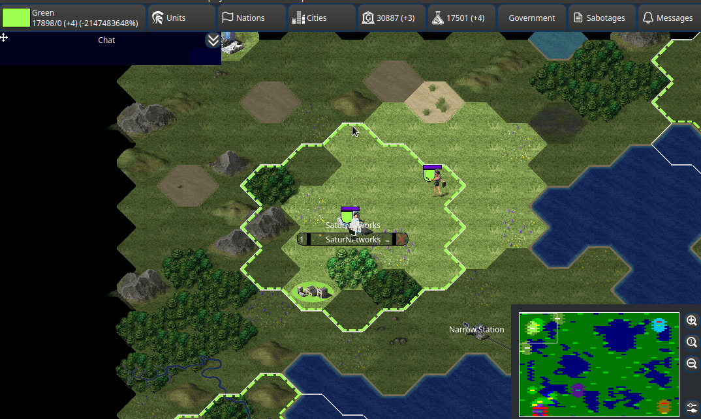
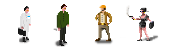
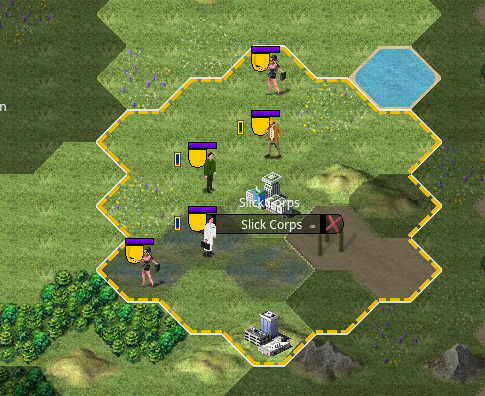
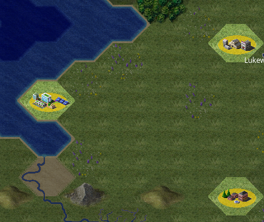
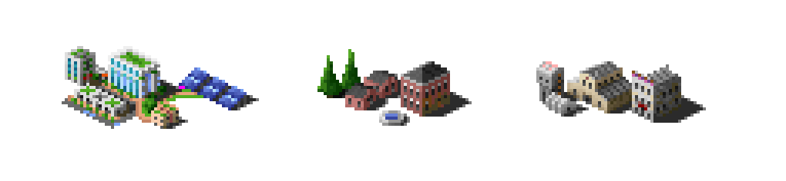
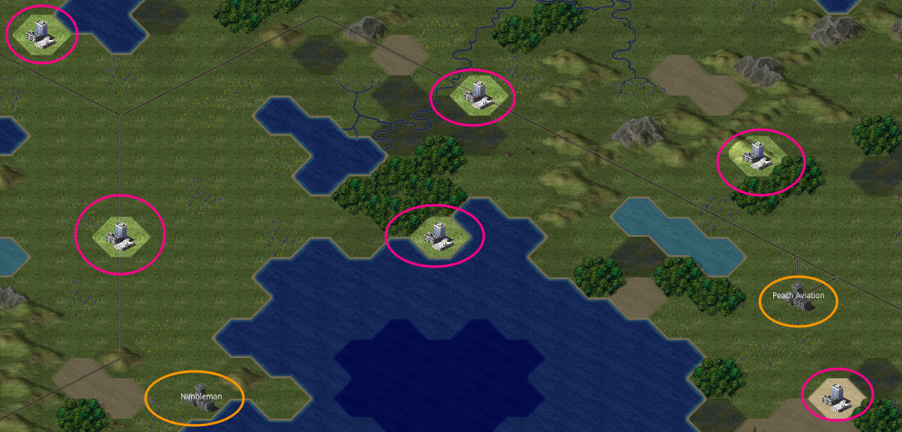
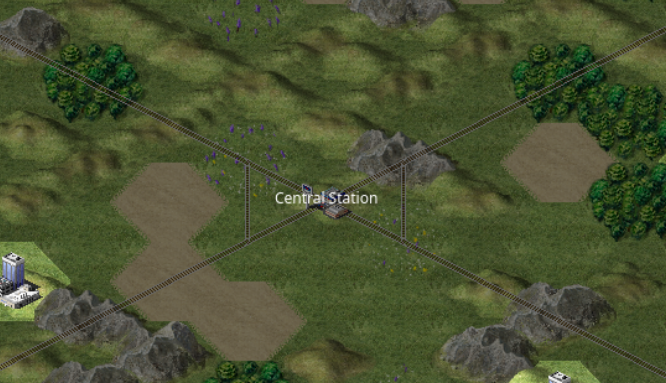
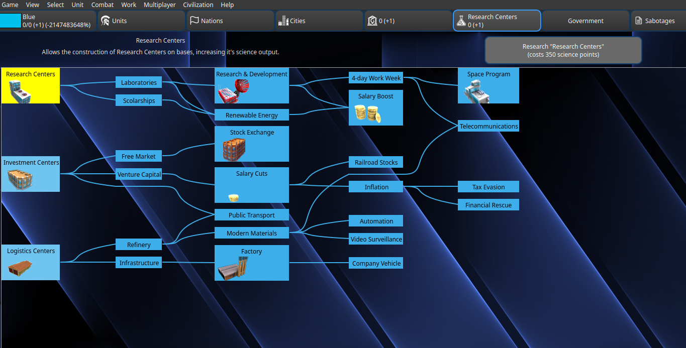

Quick-start
===========

This page serves as a quick-guide for your first session. It will cover the basics of the game, and give you a few tips to get started.

Controls
--------

- Left click on the mouse to select units.

- Left click and drag on the main window to move the camera around. You can also use the Arrow Keys.

.. image:: assets/drag_camera.gif
   :alt: Moving the camera

- With a unit selected, right click and drag to move it on the map. While moving, you'll see the expected time of arrival. You can also click on the Move option in the unit's menu.

- To select a base, click on it to bring it's menu. You can move between your bases, change production, and sell units/improvements if needed.

.. image:: assets/select_base.gif
   :alt: Selecting a base

- To select units inside a base, click on it, then double-click the unit on the lower right corner.

Phases
------

Lunar Gambit runs under two distinct phases:

- **Strategy phase** - During this phase, the game behaves like a 4X. This is the mode you'll be playing on the 20-30 minutes session. In this mode, your focus should be in capturing bases and buildings, training units, building improvements, and researching technologies. You can move all units, but your spies cannot do sabotages. The server will process turns every second, making actions and movements take a few minutes to complete.
- **Spy phase** - This phase will be turned on during breaks between sessions, running for 48 hours. During this phase, public unit movement, building units/improvements, and research are disabled (although your resources keep updating). Only the spies are enabled, and they can now perform sabotages. The server will process turns every minute, making actions and movements now potentially taking hours to complete.

During each session/strategy phase, there will be a materials objective to reach. When a player reaches this goal between 20 to 30 minutes, the session will end early.

Units
-----

There are 4 types of units in the game. You can train more public units in bases, but not spies. From left to right:

- **Public units**: These units only move during the strategy phase, and are visible to all players. They are used to capture bases and buildings, and to defend your territory.
   - **Scientists**: Focuses on research, converting buildings to universities.
   - **Bankers**: Focuses on economy, converting buildings to banks.
   - **Engineers**: Focuses on production of materials, converting buildings to factories.
- **Spies**: These units only move during the spy phase, and are nearly invisible to all players. They are used to sabotage enemy units and buildings.

While all three public units are visible everywhere on the map, spies will conceal their position and identity.

When stopped, spies become completely invisible. When moving, they will reveal that movement to any enemy units players, but not reveal it's identity. When moving into bases or buildings, that movement is also never detectable.

.. image:: assets/spy_movement.gif
   :alt: Spy movement

Bases & buildings
-----------------

Scattered throughout the map, you'll find bases and buildings.

Bases produce all three kinds of resources, and allow you to train new units, as well as build improvements. Capturing already conquered bases is a challenge which will require you to "steal" them from enemy players.

Buildings, on the other hand, can only produce one type of resource, but they are plentiful and fast to capture. All it takes is for a unit to move on top of it to capture and convert it to the unit's resource type. It will show a color underneath, indicating which player owns it.

There are three types of buildings, corresponding to each public unit:

- **University**: Produces 1 science, created by scientists.
- **Bank**: Produces 1 money, created by bankers.
- **Factory**: Produces 1 material, created by engineers.

In the beginning, all bases and buildings are unoccupied. They'll look like gray buildings, and bases have labels on them. In particular, unoccupied bases can be immediately captured by moving in public units.

Transports
----------

Transports are special, neutral buildings that allow your spies to quickly move in-between them instantly. They always have a label which ends in "Station".

Use these to position your spies quickly around the terrain. But keep in mind: unit movements in transports are **recorded**, and your opponents can obtain these reports to figure out if you've been using them!

Resources
---------

There are 3 types of resources in the game:

- **Science**: Used to research new technologies, giving you advantages over your opponents.
- **Money**: Used to sustain all unit and improvement costs.
- **Materials**: Your game "score". The player with the most materials in the end will win!

While your materials are ultimately the most important resource to win, don't neglect the other ones! If you fall behind on science, your opponents will start to get ahead of you in technology, producing more resources. If you fall behind on money and enter negative values, buildings and units will randomly and forcibly be sold.

All of these resources can be traded amongst players, including bases!

Research
--------

Research allows you to stay competitively viable. They provide you with various benefits:

- Increase resource production in your buildings.
- Allow improvements to be built in your bases, increasing their resource production.
- Reducing maintenance costs.
- Enable game features and improve units.

Each technology requires you to spend a determined number of science points. Whenever you can, research away!

Final tips
----------

While the game moves rather fast during a session, you'll have much more time to think and plan when waiting for the next session. To make sure you have a good first session, here are a few tips:

- Try to occupy 3 to 4 bases. You should have at least one base very near you that shouldn't be a problem to capture, but for the remainder ones, other players may swoop in and take them if you don't act fast!
- Try to occupy all buildings around your territory. They are very fast to capture as you only need to move a public unit over it. Capturing enemy buildings is also fast, but careful with how you want to begin your relationships with them!
- Try to get at least all of the 3 first technologies, plus 2 subsequent techs. These will provide you improvements to build, and increase building production for "free"!
- While your spies cannot do sabotages yet, you can move them during this phase. Position them in interesting spots so you can start the spy phase already prepared.
- Try to get in contact with your neighboring players, establishing initial relationships. Being overly agressive early on will likely not go well in the long run. Try to find a balance between being friendly and being competitive. Remember, there's only one winner in the end, but to get there, you'll need to know when to cooperate and when to sabotage.
- Do **not** neglect your economy. If you end the session losing money each turn, there is nothing you can do to gain more money during the spy phase, and if you run out of money, the game will start selling improvements and units!