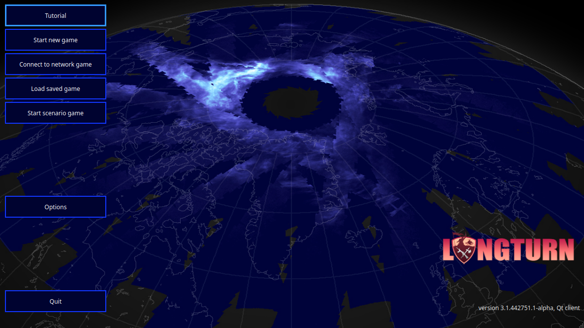
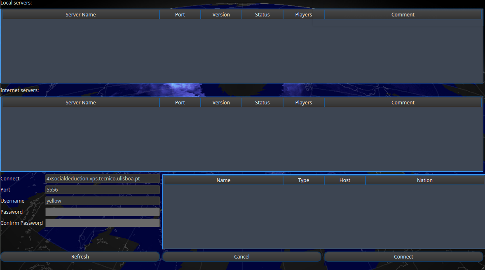
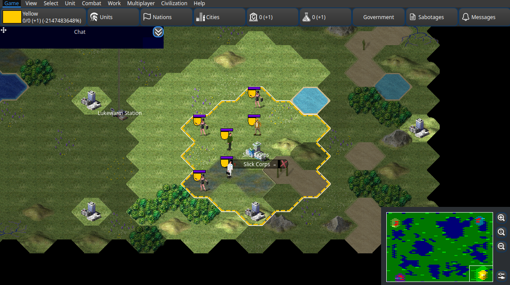
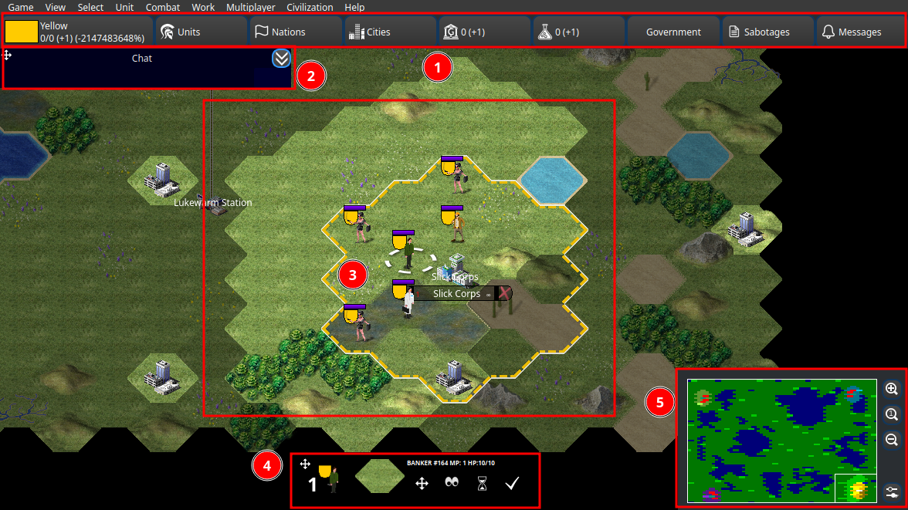

Setup
=====

.. _download:

Download
--------

Lunar Gambit is a modification done to the `freeciv21 <https://github.com/longturn/freeciv21>`_ project by `Longturn <https://longturn.net/>`_, which in turn is a modification from the original `freeciv <https://github.com/freeciv>`_ project. It's source code is available publicly under a GPL3 license at `freeciv21-spaceRace <https://github.com/rsubtil/freeciv21-spaceRace>`_.

To download the project, head to the `Releases <https://github.com/rsubtil/lunar-gambit-docs/releases>`_ tab and download the latest release. Currently, there are builds for Windows, macOS (Intel-x86 only), and Linux (Ubuntu ``.deb`` package).

Joining in
----------

When you open Lunar Gambit, you'll be greeted with the following screen:

You'll need to click on **Connect to network game**, leading you to the server screen. The server URL should be auto-filled, otherwise enter the following data:

- **Connect**: ``4xsocialdeduction.vps.tecnico.ulisboa.pt``
- **Port**: enter the port number you were given
- **Username**: enter your username

After entering this information, click on **Connect**. If the connection was successfull, it will now ask for your password, which is your unique identifier. After that, you should be able to login to the game server and join the match.

.. note::

   The default font shipped with the game for Windows and macOS can be hard to read. To change it, go to ``Options`` / ``Game > Interface Options`` -> ``Font`` and adjust them to your liking.

Interface
---------

- **1**: **Top Bar**: This bar lets you switch to the various info screens available.
- **2**: **Chat Widget**: This is where communication in game will take place. You can resize and move this element to your liking.
- **3**: **Main Window**: This is where all the action will occur, where you select and move units, and where you'll see the map.
- **4**: **Unit Bar**: When a unit is selected, this bar shows up, showing you all the available actions to perform.
- **5**: **Minimap**: This is a small version of the map, which you can use to navigate the map. You can also use it to move the main window around, and zoom in/out.