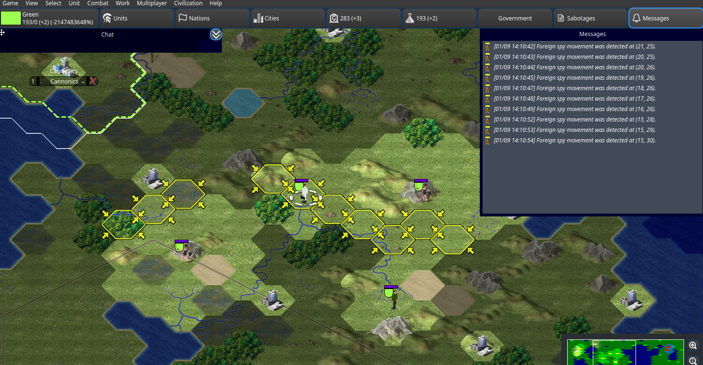
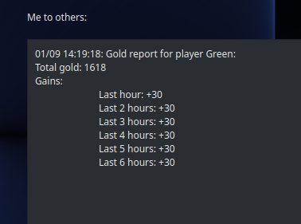
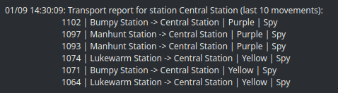
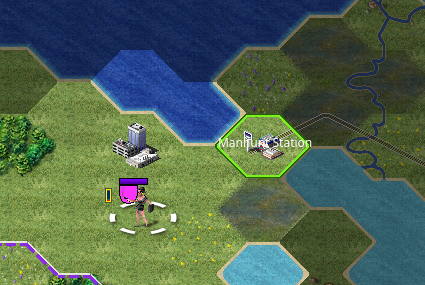

Spies
=====

This page explains in details what you can do with your spies. They are one important element to master, as you can steal resources from players, and likewise try to find out who is stealing from you to recover your resources!

Movement
--------

Spies can move during any phase, and they initially move at double rate of the public units.

When stopped, spies become completely invisible. When moving, they will reveal that movement to any enemy units players, but not reveal it's identity. When moving into bases or buildings, that movement is also never detectable.

.. image:: assets/spy_movement.gif
   :alt: Spy movement

Finding spies
-------------

Since spy movement is detectable within your vision range, the game will automatically record these events during the passive phase, storing them in your messages panel. You can click on the notifications to point to the detected tile, allowing you to track the spy's movement. With some well positioned units, you can get quite some useful information!

To get more information, you can also check if any spy has recently used a particular transport by requesting a report. You could also ask around to see if someone else knows anything...

Sabotages
---------

Spies can do two types of sabotages:

- **Defensive sabotage**: These actions merely give you information without affecting other players. While other players may know if someone has investigated them, they cannot act upon it. These actions, by default, take 15 minutos to complete.
- **Offensive sabotage**: These actions will impact other players, like stealing resources or informing of movements. If done on a player, that player will be notified something has happened. If they eventually figure out it was you, they can publicly accuse you, which could force you to lose a big chunk of your resources. These actions, by default, take 60 minutes to complete.

While you can do as many defensive sabotages as you want, you can only do a total of 2 offensive sabotages per each spy phase. Furthermore, a spy cannot perform two sabotages in a row on the same place.

There are sabotages available for all three major structures:

Sabotaging bases
----------------

Bases are large and tackle all resource types. Therefore, spies can:

- **Investigate resources** *(defensive)*: Obtain a report of the player's gains of a given one resource type's for the last 6 hours.

- **Steal resources** *(offensive)*: Steal a percentage of the player's given resource type. For science and gold, this is 20%, while for materials it's 10%.

Sabotaging buildings
--------------------

The sabotages in buildings are the same for bases, but you're only able to investigate/steal the building's resource type. If it's a bank, you can only investigate/steal gold, for example.

Sabotaging transports
---------------------

Because transports are neutral entities, no player will be alerted of your actions on them. You can:

- **Obtain movement report** *(defensive)*: Obtain a report of the the last 10 movements done to this transport.

- **Place wiretap** *(offensive)*: Place a wiretap on a transport. Whenever a unit moves to that transport, you'll be immediately notified of it. You can have only one wiretap placed on the map, and placing a new one will replace any previous one.

Being sabotaged
---------------

When you are sabotaged, you'll receive a notification. If someone has only investigated you, there's nothing you can do. However, if someone has stolen from you, you can accuse someone! How do you find which one did it, though?

- Use your spies to try to find out any foreign spies in your territory. Remember that your spies are invisible when stopped, so a few well planted spies can give you a good vision range, without the other player being aware of your presence.
- Be on the lookout for transports. Check if spies seem to be running to there, and find where they go next.
- Ask around! Maybe someone else has seen or knows something.

When you're confident you know who did it, you can accuse them. If you're right, you'll get back a hefty percentage of the accused's resources. If you're wrong though, you'll be the one paying them. Be careful!

More info on the process can be found in the :ref:`accusations` page.